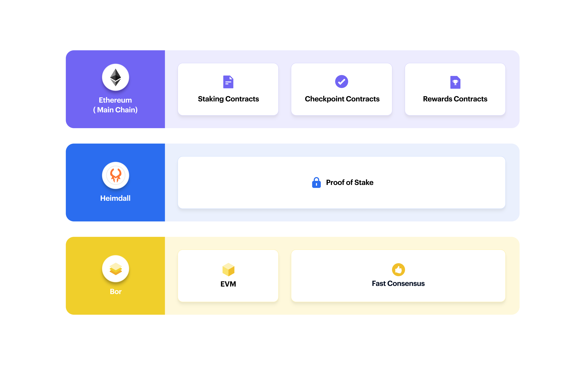

# Polygon full node

## overview

Full polygon node.

- Proof of Stake node - called Heimdall
- REST API server - also called Heimdall
- EVM node - called Bor.




1. [Connect to Server](## Connect to the server)
2. [Requeriments](## Requeriments)
3. [Install Services](## Install services)
4. [Run Services](## Run services)

## Connect to the server

### Ip & Login

```
ssh root@168.119.211.163
```

### sessions

```sh
screen -ls
screen -r bot --> to join bor session
screen -r heimdalld -->  to join heimdall session
screen -r heimdallr -->  to join heimdallr session
```

### Rpc

```
geth attach 168.119.211.163:8545

# or
geth attach http://mihailo.tradingstrategy.ai

# or
geth attach https://mihailo.tradingstrategy.ai

```

### Monitoring

Datadog

## Requirements

- OS: Ubuntu 20.4
- installing go  https://golang.org/doc/install ***version installed 1.17.3***

```
# install
 apt-get update apt-get install wget build-essential make gcc git -y

# install go

 wget https://golang.org/dl/go1.17.3.linux-amd64.tar.gz

 rm -rf /usr/local/go && tar -C /usr/local -xzf go1.17.3.linux-amd64.tar.gz

 export PATH=$PATH:/usr/local/go/bin

 go version
```

## Install Services

### heimdall

#### 1 Clone Heimdall code repository:
  ```git clone https://github.com/maticnetwork/heimdall.git```
#### 2. Move to Heimdall directory with source code:
  ```cd heimdall```
#### 3. Switch to the latest release branch:
  ```git checkout v0.2.2```
#### 4. Build the source code:
  ```make install```
#### 5. Confirm binaries were built:
  ```/polygon/go/bin/heimdalld version The version of Heimdall is output.```

### heimdall rest

we don't have to do any specific its a heimdall service but with different configuration. See How to run.

### Bor

Replace all the paths with the ones you prefer

#### 1.Create bor data directory:

```
mkdir -p /polygon/bor_data
mkdir -p /polygon/bor_data/data
```

#### 2. Download bor genesis file:
```
wget https://raw.githubusercontent.com/maticnetwork/launch/master/mainnet-v1/sentry/sentry/bor/genesis.json
cp -rf genesis.json /polygon/bor_data/gensis.json
```
#### 3. Initialize Bor data directory and genesis:
```
bor --datadir $HOME/bor_data/data init genesis.json
```
#### 4. Download and replace genesis file:
```
cp -rf launch/mainnet-v1/sentry/sentry/bor/genesis.json $BOR_DIR/genesis.json #
```
#### 5. Prepare script for running bor:
Script to run bor. Modify as required.

```
/polygon/start_bor.sh
```

## Genesis and Snapshots

### site to get versions

``` https://snapshots.matic.today/ ```

### create genesis & download for heimdall snapshot

```
mkdir -p /polygon/heimdall_data

heimdalld init --home /polygon/heimdall_data

wget https://raw.githubusercontent.com/maticnetwork/launch/master/mainnet-v1/sentry/sentry/heimdall/config/genesis.json

cp -rf genesis.json $HOME/heimdall_data/config/genesis.json

# edit $HOME/heimdall_data/config/config.toml

sed -i '/moniker/c\moniker = "tradingstrategy"' /polygon/heimdall_data/config/config.toml
sed -i '/seeds/c\seeds = "f4f605d60b8ffaaf15240564e58a81103510631c@159.203.9.164:26656,4fb1bc820088764a564d4f66bba1963d47d82329@44.232.55.71:26656"' $HOME/heimdall_data/config/config.toml
sed -i '/eth_rpc_url/c\eth_rpc_url = "https://my-ethereum-mainnet-endpoint.com"' $HOME/heimdall_data/config/config.toml

wget -c https://matic-blockchain-snapshots.s3-accelerate.amazonaws.com/matic-mainnet/heimdall-snapshot-2021-11-02.tar.gz -O - | tar -xz -C /polygon/heimdall_data/data
```

### download for bor genesis & snapshot
```
mkdir -p /polygon/bor_data

mkdir -p /polygon/bor_data/data

wget https://raw.githubusercontent.com/maticnetwork/launch/master/mainnet-v1/sentry/sentry/bor/genesis.json

cp -rf genesis.json $HOME/bor_data/gensis.json

bor --datadir /polygon/bor_data/data init genesis.json

cp -rf launch/mainnet-v1/sentry/sentry/bor/genesis.json /polygon/bor/genesis.json #

wget -c https://matic-blockchain-snapshots.s3-accelerate.amazonaws.com/matic-mainnet/bor-pruned-snapshot-2021-10-11.tar.gz -O - | tar -xz -C /polygon/bor_data/data/bor/chaindata
```

## Run Services

### create a screen session for each

screen -S heimdalld
screen -S heimdallr
screen -S bor

**Other options are to create a service or run them with docker**

### Heimdall

```
/polygon/go/bin/heimdalld start --home $HOME/heimdall_data/ --rpc.laddr tcp://0.0.0.0:26657
```
### Heimdallr (rest server)

```
/polygon/go/bin/heimdalld rest-server --home $HOME/heimdall_data
```

### BOR

**IMPORTANT**

Before running bor, wait until heimdall is synchronized.
To check the sync status, run the following command:

```
curl 127.0.0.1:26657/status
catching_up should show false
```

create a start_bor.sh script
```sh
#!/usr/bin/env sh

set -e # stop or error
set -x # echo on

BOR_DIR=${BOR_DIR:-/bor_data} # data folder of bor
DATA_DIR=/polygon/bor_data/data

/polygon/go/bin/bor --datadir $DATA_DIR \
  --port 30303 \
  --http --http.addr '127.0.0.0' \
  --http.vhosts '*' \
  --http.corsdomain '*' \
  --http.port 8545 \
  --ws --ws.addr '127.0.0.0' \
  --ws.port 8546 \
  --bor.logs \
  --verbosity 3 \
  --ipcpath $DATA_DIR/bor.ipc \
  --http.api 'debug,eth,net,web3,bor' \
  --syncmode 'full' \
  --gcmode 'archive' \
  --networkid '137' \
  --miner.gaslimit '200000000' \
  --miner.gastarget '20000000' \
  --txpool.nolocals \
  --txpool.accountslots '128' \
  --txpool.globalslots '20000'  \
  --txpool.lifetime '0h16m0s' \
  --txlookuplimit 0 \
  --graphql \
  --graphql.vhosts=* \
  --maxpeers 200 \
  --metrics \
  --bootnodes "enode://0cb82b395094ee4a2915e9714894627de9ed8498fb881cec6db7c65e8b9a5bd7f2f25cc84e71e89d0947e51c76e85d0847de848c7782b13c0255247a6758178c@44.232.55.71:30303,enode://88116f4295f5a31538ae409e4d44ad40d22e44ee9342869e7d68bdec55b0f83c1530355ce8b41fbec0928a7d75a5745d528450d30aec92066ab6ba1ee351d710@159.203.9.164:30303"

```
## proxy server

We use caddy as reverse proxy: caddyserver.com

Modify file /etc/caddyfile

```json
mihailo.tradingstrategy.ai {
  reverse_proxy 127.0.0.1:9000
}
```

```sh
caddy start
```


